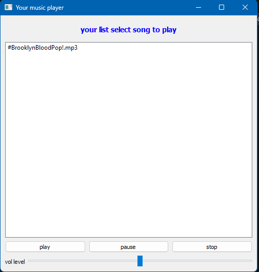

# PyMusic Player 🎵

A lightweight desktop music player built with Python, designed for playing and managing local audio files with a clean graphical interface.



## 🌟 Key Features
- **Local Audio Playback**: Seamless play, pause, stop, and track control for `.mp3` files.
- **Automatic Track Scanning**: Automatically scans and loads audio files from the local `music/` directory.
- **Sleek GUI**: Built using PyQt5 for a responsive, user-friendly layout and playlist control.
- **Playback Controls**: Volume adjustment and track navigation.

## 🛠️ Tech Stack
- **Python 3** - Core programming language.
- **PyQt5** - Graphical User Interface (GUI) framework.
- **Pygame (`pygame.mixer`)** - Audio handling and playback engine.

## 🚀 Installation & Setup

### 1. Clone the repository
```bash
git clone [https://github.com/namoraomar56-rgb/py-music-player.git](https://github.com/namoraomar56-rgb/py-music-player.git)
cd py-music-player
